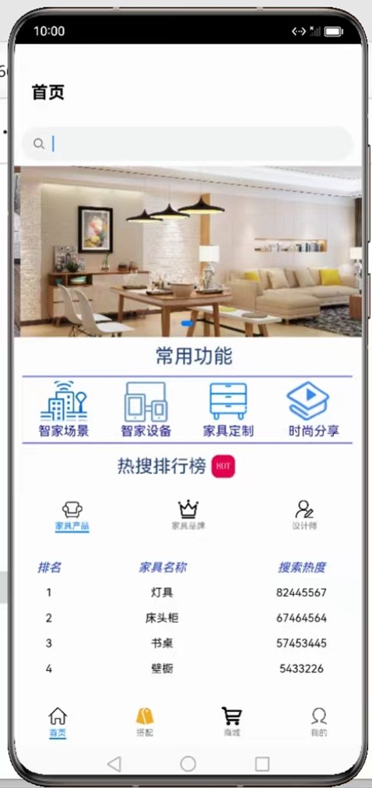

# 领航智能家居（JS）

### 简介
本篇Codelab基于ArkUI实现了一个展示领航智能家居的应用，主要用于呈现ArkUI的基本能力和动画效果，效果图如下：

### 相关概念
- [Swiper](https://developer.harmonyos.com/cn/docs/documentation/doc-references-V3/ts-container-swiper-0000001427744844-V3?catalogVersion=V3)：滑动容器，提供子组件切换滑动的能力。
- [Row/Column](https://developer.harmonyos.com/cn/docs/documentation/doc-guides-V3/arkts-layout-development-linear-0000001504125349-V3)：Column容器内子元素按照垂直方向排列，Row容器内子元素按照水平方向排列。
- [Stack](https://developer.harmonyos.com/cn/docs/documentation/doc-references-V3/ts-container-stack-0000001427584888-V3?catalogVersion=V3)：堆叠容器，子组件按照顺序依次入栈，后一个子组件覆盖前一个子组件。
- [Flex组件](https://developer.harmonyos.com/cn/docs/documentation/doc-references-V3/ts-container-flex-0000001427902472-V3?catalogVersion=V3)：以弹性方式布局子组件的容器组件。
- [自定义弹窗](https://developer.harmonyos.com/cn/docs/documentation/doc-references-V3/ts-methods-custom-dialog-box-0000001477981237-V3?catalogVersion=V3) ： 通过CustomDialogController类显示自定义弹窗。
- [Search组件](https://developer.harmonyos.com/cn/docs/documentation/doc-references-V3/ts-basic-components-search-0000001428061740-V3?catalogVersion=V3)：搜索框组件，适用于浏览器的搜索内容输入框等应用场景。
- [Text组件](https://developer.harmonyos.com/cn/docs/documentation/doc-references-V3/ts-basic-components-text-0000001477981201-V3?catalogVersion=V3)：显示一段文本的组件。
- [Image组件](https://developer.harmonyos.com/cn/docs/documentation/doc-references-V3/ts-basic-components-image-0000001428061728-V3?catalogVersion=V3)：图片组件，支持本地图片和网络图片的渲染展示。
- [Tabs组件](https://developer.harmonyos.com/cn/docs/documentation/doc-references-V3/ts-container-tabs-0000001478181433-V3?catalogVersion=V3)：通过页签进行内容视图切换的容器组件，每个页签对应一个内容视图。
- [List组件](https://developer.harmonyos.com/cn/docs/documentation/doc-references-V3/ts-container-list-0000001477981213-V3?catalogVersion=V3)：列表包含一系列相同宽度的列表项，包含子组件ListItem。
- [循环渲染](https://developer.harmonyos.com/cn/docs/documentation/doc-guides-V3/arkts-rendering-control-foreach-0000001524537153-V3?catalogVersion=V3)：ForEach基于数组类型数据执行循环渲染。
- [video组件](https://developer.harmonyos.com/cn/docs/documentation/doc-references-V3/js-components-media-video-0000001478061773-V3?catalogVersion=V3)：视频播放组件。
- [slider组件](https://developer.harmonyos.com/cn/docs/documentation/doc-references-V3/js-components-basic-slider-0000001427744892-V3?catalogVersion=V3)：滑动条组件，用来快速调节设置值，如音量、亮度等。
- [Webview](https://developer.harmonyos.com/cn/docs/documentation/doc-references-V3/js-apis-webview-0000001427902720-V3)：提供Web控制能力，Web组件提供网页显示能力。
- [HTTP数据请求](https://developer.harmonyos.com/cn/docs/documentation/doc-references-V3/js-apis-http-0000001478061929-V3?catalogVersion=V3)：网络管理模块，提供HTTP数据请求能力，支持GET、POST、OPTIONS、HEAD、PUT、DELETE、TRACE、CONNECT请求方法。HTTPS：应用层协议，支持加密传输以及身份认证，保证数据的安全传输。SSL：SSL（Secure Socket Layer）安全套接层是位于传输通信协议（TCP/IP）之上实现的一种安全协议。TLS：TLS（Transport Layer Security）是一种安全协议，旨在实现数据加密传输。
- [栅格布局](https://developer.harmonyos.com/cn/docs/documentation/doc-guides-V3/arkts-layout-development-grid-layout-0000001454765270-V3?catalogVersion=V3):保证不同设备上各个模块的布局一致性。这可以减少设计和开发的复杂度，提高工作效率。
- [GridRow](https://developer.harmonyos.com/cn/docs/documentation/doc-references-V3/ts-container-gridrow-0000001478181425-V3?ha_linker=eyJ0cyI6MTY5MDg5MzgzOTg5MywiaWQiOiI4ZjRmOTI2ZTdjOWViNGVlZjc5MmQ5MTczOWFiMzU3MyJ9)：栅格容器组件，仅可以和栅格子组件（GridCol）在栅格布局场景中使用。
- [GridCol](https://developer.harmonyos.com/cn/docs/documentation/doc-references-V3/ts-container-gridcol-0000001427744832-V3)：容器中主轴的方向是垂直方向。
- [ArkTS卡片](https://developer.harmonyos.com/cn/docs/documentation/doc-guides-V3/arkts-ui-widget-working-principles-0000001485485850-V3)：卡片框架的运作机制分三大模块：卡片使用方、卡片管理服务和卡片提供方。
- [TextInput](https://developer.harmonyos.com/cn/docs/documentation/doc-guides-V3/arkts-common-components-text-input-0000001458538980-V3)：TextInput、TextArea是输入框组件，通常用于响应用户的输入操作.

### 相关权限
不涉及

### 使用说明
1.  打开应用时进入启动页，启动领航智能家居轮播展示图，登录注册之后进入应用首页。
2.  在首页的“智能场景”标签页，自定义智能场景，实现多设备触发条件和执行操作和设备联动。
3.  在首页的“智家设备”标签页，可以智家设备管理，支持远程控制、分区域管理和直接购买。
4.  在首页的“定制家具”标签页，可以查看选择家具分类款式，找金牌设计师定制和上传自定义设计进行共享。
5.  在首页的“时尚分享”标签页，可以播放最新设计，流行趋势视频分享，在评论区交流。
5.  在首页的“热搜排行榜”中，可以热门家具产品、品牌品牌和设计师，设计师排名及擅长风格，可直接联系并获取设计服务。
6.  在“搭配”页面中，可以设置全宅、1楼、餐厅、书房、客厅、书房、主卧、次卧等多个场景，为每个空间进行个性化设计。
7.  在“商城“页面中，可以按照不同标准排序自己搜索的商品。
8.  在”个人中心“页面，可以管理房屋管理，成员管理，产品管理，会员管理，银行卡管理和设置，提供了一个方便、集中、个性化的管理界面。

### 约束与限制
1. 本示例仅支持标准系统上运行，支持设备：华为手机或运行在DevEco Studio上的华为手机设备模拟器。
2. 本示例为FA模型，支持API version 9。
3. 本示例需要使用DevEco Studio 3.1 Release版本进行编译运行。